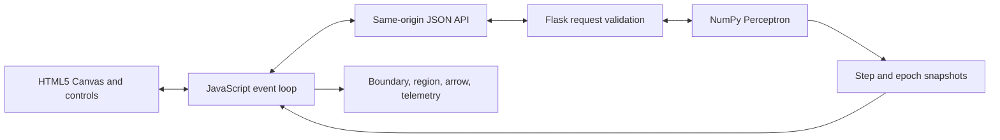

# Student Exam Pass/Fail Predictor: An Interactive Perceptron Learning Lab

## 1. Title and Problem Overview

### 1.1 Purpose

This project turns the Perceptron Learning Rule from Chapter 4 of Martin T. Hagan's *Neural Network Design* into a visible, interactive experiment. A user places student records on a two-dimensional graph, asks a single artificial neuron to learn, and watches its straight decision boundary move after each example.

The application is an educational classifier, not a real admissions or grading system. Real exam outcomes depend on many factors, the tiny example data sets are invented, and a responsible high-stakes model would require careful data governance, fairness analysis, uncertainty estimates, and human review.

### 1.2 Formal problem

Each student is represented by a column vector:

\[
p = \begin{bmatrix}p_1 \\ p_2\end{bmatrix} \in \mathbb{R}^2
\]

| Symbol | Meaning | Range in this application |
|---|---|---:|
| \(p_1\) | Study hours per week | 0 to 10 |
| \(p_2\) | Normalized class attendance | 0 to 10 |
| \(t\) | Desired class | 0 or 1 |

On the attendance axis, 0 means 0% and 10 means 100%, so an attendance value of 7.5 represents 75%.

The targets are:

- \(t=1\): Pass, shown in green.

- \(t=0\): Fail, shown in red.

The neuron computes a score, or net input:

\[
n = w^T p+b=w_1p_1+w_2p_2+b
\]

It converts that score to a class with the hard-limit function:

\[
a=\operatorname{hardlim}(n)=
\begin{cases}
1, & n\ge 0 \\
0, & n<0
\end{cases}
\]

The equality matters: a student exactly on the boundary is assigned to Class 1, Pass.

### 1.3 Why a two-input perceptron is suitable here

A two-input perceptron is a good teaching model for four reasons:

1. The two features can be drawn directly on a Cartesian plane. Nothing has to be hidden in a high-dimensional chart.
2. The output is binary, matching the two values produced by `hardlim`.
3. The learned parameters have a visible geometric meaning. The weights control the boundary's orientation, the bias shifts it, and the weight vector points toward the positive region.
4. When the invented students are linearly separable, one straight line is enough and the convergence theorem applies.

The last condition is also the model's central limitation. If Pass and Fail points are interlocked like XOR, no single straight line can classify them all. The app treats this as a lesson: training stops at a finite epoch limit and explains why the corrections keep conflicting.

### 1.4 Decision geometry

The decision boundary contains all points whose net input is zero:

\[
w_1p_1+w_2p_2+b=0
\]

When \(w_2\ne0\), it can be written in slope-intercept form:

\[
p_2=-\frac{w_1}{w_2}p_1-\frac{b}{w_2}
\]

When \(w_2=0\) but \(w_1\ne0\), the boundary is vertical:

\[
p_1=-\frac{b}{w_1}
\]

The frontend handles both forms without dividing by a value close to zero. The lightly green-shaded half-plane satisfies \(w^Tp+b\ge0\), and the blue arrow follows \(w\), the normal vector pointing into that positive region.

## 2. Deep-Dive Algorithm Description (Hagan Chapter 4)

### 2.1 Source alignment

The supplied file `Neural Network Design Hagan-72-104.pdf` is a 33-page scan of Chapter 4. The implementation follows these specific parts:

| Chapter page | Material used in the application |
|---|---|
| 4-5 | `hardlim`, the two-input single-neuron architecture, and \(n=w^Tp+b\) |
| 4-8 to 4-12 | Supervised input/target pairs and the three correction cases |
| 4-12 | Unified error and weight/bias updates, Equations 4.32 to 4.35 |
| 4-15 to 4-18 | Augmented notation and convergence proof |
| 4-19 | Linear separability and the XOR limitation |

The discussion below paraphrases the chapter and applies it to the student scenario.

### 2.2 The single-neuron architecture

The model has only five conceptual pieces:

- **Inputs** \(p_1,p_2\): the student's measured features.

- **Weights** \(w_1,w_2\): signed coefficients expressing the boundary's current orientation.

- **Bias** \(b\): a constant offset that lets the boundary move away from the origin.

- **Net input** \(n=w^Tp+b\): the continuous score before classification.

- **Activation** \(a=\operatorname{hardlim}(n)\): the final binary prediction.

The weights should not be read as reliable causal effects. In this tiny teaching model, they are geometric parameters chosen only to classify the placed points.

### 2.3 From three correction cases to one rule

Supervised learning supplies a pair \(\{p,t\}\). The perceptron predicts \(a\), then computes:

\[
e=t-a
\]

Because both \(t\) and \(a\) are binary, \(e\) can only be \(-1\), \(0\), or \(1\).

| Situation | Error | Meaning | Weight action |
|---|---:|---|---|
| Target Pass, predicted Fail | \(1-0=1\) | False negative | Add \(p^T\) |
| Target Fail, predicted Pass | \(0-1=-1\) | False positive | Subtract \(p^T\) |
| Prediction matches target | \(0\) | Correct | Make no change |

All three cases are expressed by one equation:

\[
W^{new}=W^{old}+ep^T
\]

The bias acts like a weight attached to a constant input of 1:

\[
b^{new}=b^{old}+e
\]

The class uses a configurable learning rate \(\alpha\), so its general implementation is:

\[
W^{new}=W^{old}+\alpha ep^T,\qquad b^{new}=b^{old}+\alpha e
\]

The application fixes \(\alpha=1\), exactly recovering Hagan's rule.

### 2.4 A complete numerical training step

Suppose the zero-initialized model sees a failing student:

\[
p=\begin{bmatrix}2\\3\end{bmatrix},\quad t=0,\quad W=[0\;0],\quad b=0
\]

First it predicts:

\[
n=[0\;0]\begin{bmatrix}2\\3\end{bmatrix}+0=0,
\qquad a=\operatorname{hardlim}(0)=1
\]

The boundary convention makes the zero model predict Pass. That is wrong here:

\[
e=t-a=0-1=-1
\]

The correction subtracts the input vector and reduces the bias:

\[
W^{new}=[0\;0]+(-1)[2\;3]=[-2\;-3]
\]

\[
b^{new}=0+(-1)=-1
\]

The animation shows exactly this transition and keeps the active red point ringed while the line moves.

### 2.5 Why the rule converges for separable data

Hagan's proof combines the bias and weights into one augmented vector:

\[
x=\begin{bmatrix}w\\b\end{bmatrix}
\]

Each input is augmented with the constant bias input:

\[
z_q=\begin{bmatrix}p_q\\1\end{bmatrix}
\]

For a misclassified Class 1 sample, define \(z'_q=z_q\). For a misclassified Class 0 sample, define \(z'_q=-z_q\). Every actual correction can then be written:

\[
x(k)=x(k-1)+z'(k-1)
\]

Assume a separating solution \(x^*\) exists with positive margin \(\delta\):

\[
{x^*}^Tz'_q>\delta>0
\]

After \(k\) weight changes, summing those positive advances gives:

\[
{x^*}^Tx(k)>k\delta
\]

The Cauchy-Schwarz inequality gives:

\[
\left({x^*}^Tx(k)\right)^2\le\lVert x^*\rVert^2\lVert x(k)\rVert^2
\]

Combining the preceding two inequalities produces a lower bound:

\[
\lVert x(k)\rVert^2>\frac{(k\delta)^2}{\lVert x^*\rVert^2}
\]

Now examine the same norm from the update side:

\[
\lVert x(k)\rVert^2
=\lVert x(k-1)+z'(k-1)\rVert^2
\]

\[
=\lVert x(k-1)\rVert^2
+2x(k-1)^Tz'(k-1)
+\lVert z'(k-1)\rVert^2
\]

An update happens only for a misclassified point, so the cross term is non-positive. If

\[
\Pi=\max_i\lVert z'(i)\rVert^2,
\]

then repeated application gives the upper bound:

\[
\lVert x(k)\rVert^2\le k\Pi
\]

The lower and upper bounds must both hold:

\[
k\Pi>\frac{(k\delta)^2}{\lVert x^*\rVert^2}
\]

For positive \(k\), this implies:

\[
k<\frac{\Pi\lVert x^*\rVert^2}{\delta^2}
\]

Therefore the number of weight changes has a finite upper bound when a separator with positive margin exists, inputs have bounded length, and updates occur only on mistakes. A small margin makes the bound large, which explains why the Boundary Edge Case can require visibly more corrections.

### 2.6 Why XOR does not converge

In the XOR-like preset, two diagonal corners are Fail and the other two are Pass. Any straight line that places one positive corner correctly leaves another corner on the wrong side. The perceptron is not broken; the requested shape is outside the representational capacity of one linear boundary.

The server stops after `max_epochs`, returns all completed history, and labels the result `not_converged`. Reaching the limit is evidence that the selected training run did not find a separator; in general, a finite limit alone is not a mathematical proof of non-separability. For the displayed XOR geometry, the impossibility can also be seen directly.

### 2.7 Walkthrough of `perceptron.py`

#### `__init__(input_dim=2, learning_rate=1.0)`

Core initialization:

```python
self.input_dim = input_dim
self.learning_rate = float(learning_rate)
self.weights: NDArray[np.float64] = np.zeros(input_dim, dtype=np.float64)
self.bias = 0.0
```

Line by line:

1. `input_dim` records how many values every input vector must contain.
2. The learning rate is converted to a regular floating-point value after validation.
3. `np.zeros(input_dim)` creates one weight per feature. For this app its shape is `(2,)`.
4. The scalar bias begins at zero, making the initial state deterministic.

The validation above these lines rejects Boolean dimensions, non-positive dimensions, and non-finite or non-positive learning rates.

#### `hardlim(net)`

```python
net_array = np.asarray(net, dtype=np.float64)
activations = (net_array >= 0.0).astype(np.int64)
return int(activations) if activations.ndim == 0 else activations
```

1. A scalar or sequence becomes a NumPy array.
2. The comparison is vectorized: every element is tested at once. Boolean results become integer 0 or 1 values.
3. A scalar input returns a normal Python integer for convenient JSON handling; a batch keeps its NumPy array.

#### `_coerce_inputs(p)`

This private boundary validates one sample or a whole sample matrix before any matrix multiplication:

```python
inputs = np.asarray(p, dtype=np.float64)
is_single_sample = inputs.ndim == 1

if is_single_sample:
    if inputs.shape != (self.input_dim,):
        raise ValueError(
            f"A sample must have shape ({self.input_dim},), got {inputs.shape}."
        )
elif inputs.ndim == 2:
    if inputs.shape[1] != self.input_dim:
        raise ValueError(
            f"Each sample must contain {self.input_dim} features; "
            f"received shape {inputs.shape}."
        )
else:
    raise ValueError("Inputs must be one sample or a two-dimensional sample matrix.")

if not np.all(np.isfinite(inputs)):
    raise ValueError("Inputs must contain only finite numbers.")

return inputs, is_single_sample
```

The first two lines normalize the type and identify a vector. The branches require either shape `(input_dim,)` or `(sample_count, input_dim)`. The finite-number check blocks NaN and infinity, which could otherwise make every later comparison unreliable. The Boolean flag lets `net_input` preserve scalar-versus-batch return behavior.

#### `_coerce_dataset(P, T)`

```python
samples, is_single_sample = self._coerce_inputs(P)
if is_single_sample:
    samples = samples.reshape(1, self.input_dim)

targets_raw = np.asarray(T)
if targets_raw.ndim != 1 or len(targets_raw) != len(samples):
    raise ValueError("T must be a one-dimensional target vector aligned with P.")
if len(samples) == 0:
    raise ValueError("The training set must contain at least one sample.")
if not np.all(np.isin(targets_raw, (0, 1))):
    raise ValueError("Every target must be either 0 or 1.")

return samples, targets_raw.astype(np.int64)
```

1. Inputs pass through the shape and finiteness validator.
2. A single sample is reshaped to one matrix row so all later training code has a uniform `(Q, R)` representation.
3. Targets become an array, must be one-dimensional, and must have exactly one entry per sample.
4. Empty training and non-binary targets are rejected.
5. The returned targets use an integer NumPy type.

#### `net_input(p)`

```python
inputs, is_single_sample = self._coerce_inputs(p)
nets = inputs @ self.weights + self.bias
return float(nets) if is_single_sample else np.asarray(nets, dtype=np.float64)
```

The `@` operator is the central matrix operation. With one vector it calculates one dot product. With a matrix of students, each row is dotted with the same weight vector, returning one score per student. NumPy broadcasts the scalar bias across every row. The return statement produces a Python float for one student and an array for a batch.

#### `predict(p)`

```python
return self.hardlim(self.net_input(p))
```

The inner call calculates all net inputs. The outer call thresholds them. Because both functions accept a vector or matrix, prediction is vectorized without a Python loop.

#### `train_step(p, t)`

The learning operation is:

```python
sample, is_single_sample = self._coerce_inputs(p)
if not is_single_sample:
    raise ValueError("train_step accepts exactly one input sample.")
if isinstance(t, bool) or t not in (0, 1):
    raise ValueError("The target t must be the integer 0 or 1.")

weights_before = self.weights.copy()
bias_before = self.bias

net = float(self.weights @ sample + self.bias)
activation = int(self.hardlim(net))
error = int(t - activation)

if error != 0:
    self.weights = self.weights + self.learning_rate * error * sample
    self.bias = self.bias + self.learning_rate * error
```

1. Exactly one finite feature vector and one binary target are required.
2. Copies of the old parameters are kept for the animation diagnostics.
3. `self.weights @ sample` is \(w^Tp\); adding the bias gives \(n\).
4. `hardlim` gives \(a\), then subtraction gives \(e=t-a\).
5. A nonzero error scales the entire feature vector and adds that correction to the weights.
6. The same scalar error corrects the bias. When error is zero, leaving the parameters untouched avoids needless floating-point operations.

The returned dictionary includes `p`, `t`, `n`, `a`, `e`, old and new parameters, and `updated`. Every value is converted to a JSON-friendly Python type.

#### `train_epoch(P, T)`

```python
samples, targets = self._coerce_dataset(P, T)
history: list[dict[str, Any]] = []

for sample_index, (sample, target) in enumerate(zip(samples, targets)):
    diagnostics = self.train_step(sample, int(target))
    diagnostics["sample_index"] = sample_index
    history.append(diagnostics)

return history
```

1. The complete data set is validated once.
2. `zip` preserves the submitted order of input/target pairs.
3. Each call updates immediately, so the next sample sees the newest parameters. This is online learning, not a batch average.
4. The point index is attached for the active ring on the canvas.
5. The complete pass is returned as history.

#### `_accuracy(samples, targets)`

```python
predictions = np.asarray(self.predict(samples), dtype=np.int64)
return float(np.mean(predictions == targets))
```

The first line predicts every student with one vectorized matrix calculation. The comparison creates a Boolean array such as `[True, False, True]`. NumPy treats `True` as 1 and `False` as 0, so the mean is the correctly classified fraction.

#### `fit(P, T, max_epochs=100)`

`fit` coordinates repeated epochs. Its main loop is:

```python
for epoch_number in range(1, max_epochs + 1):
    if converged:
        break

    updates_this_epoch = 0
    for sample_index, (sample, target) in enumerate(zip(samples, targets)):
        global_step += 1
        diagnostics = self.train_step(sample, int(target))
        updates_this_epoch += int(diagnostics["updated"])
        diagnostics.update(
            {
                "epoch": epoch_number,
                "sample_index": sample_index,
                "global_step": global_step,
                "accuracy": self._accuracy(samples, targets),
            }
        )
        step_history.append(diagnostics)

    epochs_completed = epoch_number
    epoch_accuracy = self._accuracy(samples, targets)
    converged = epoch_accuracy == 1.0
    epoch_history.append(
        {
            "epoch": epoch_number,
            "updates": updates_this_epoch,
            "accuracy": epoch_accuracy,
            "W": self.weights.tolist(),
            "b": float(self.bias),
            "converged": converged,
        }
    )
```

1. The outer loop counts full passes from 1 through the inclusive epoch limit.
2. An already-correct model exits without another pass.
3. The inner loop processes every sample in order and increments the global sample counter.
4. `train_step` performs the exact online update; its `updated` flag counts real corrections.
5. Epoch, sample, global-step, and whole-data accuracy metadata are attached to that precise parameter snapshot.
6. After the pass, accuracy is recalculated. Exactly `1.0` means every sample is correct.
7. The compact epoch record supports summaries without discarding the detailed step animation.

Before this loop, `fit` validates the data and records the initial zero state. After it, the method returns both histories, convergence state, epoch/step/update counts, and final parameters. The input data is never shuffled, so two runs over the same ordered points produce the same animation.

## 3. Full-Stack Web Architecture & Engineering Guide

### 3.1 Architecture flow



The system is deliberately small:

- The browser owns temporary points, animation position, and drawing.
- JavaScript sends the ordered points to Flask once per new training path.
- Flask validates the request and trains a fresh deterministic model.
- NumPy returns serializable state after every sample.
- JavaScript interpolates between consecutive states for smooth motion.

No database is required. The user can reset the lab without leaving persistent records behind.

### 3.2 Project structure

```text
student_perceptron_app/
├── .gitignore
├── .python-version
├── .vercelignore
├── app.py
├── perceptron.py
├── pyproject.toml
├── requirements.txt
├── uv.lock
├── vercel.json
├── public/
│   └── static/
│       ├── script.js
│       └── style.css
├── static/
│   ├── script.js
│   └── style.css
├── templates/
│   └── index.html
├── tests/
│   └── test_app.py
└── report.md
```

`static/` is Flask's local asset directory. `public/static/` mirrors the same verified files because Vercel serves public assets from `public/**` through its CDN. Both locations resolve to `/static/style.css` and `/static/script.js`, so `index.html` works unchanged locally and in production.

`requirements.txt` is the simple `pip` installation path used by the local instructions. Vercel's current Python tooling also materializes `pyproject.toml` and `uv.lock`; together they lock the same two direct dependencies and their transitive packages for the Python 3.14 deployment build.

### 3.3 Browser-to-feature coordinate transformation

Browser canvas coordinates start at the top-left. The mathematical graph starts at the bottom-left. Let the drawable plot have left edge \(L\), top edge \(T\), width \(G_w\), and height \(G_h\). For a pointer pixel \((x,y)\):

\[
p_1=10\frac{x-L}{G_w}
\]

\[
p_2=10\frac{(T+G_h)-y}{G_h}
\]

The reversed vertical subtraction makes upward motion increase attendance.

Drawing uses the inverse mapping:

\[
x=L+\frac{p_1}{10}G_w
\]

\[
y=T+G_h-\frac{p_2}{10}G_h
\]

`roundFeature` clamps both values to `[0, 10]` and rounds to two decimal places. Canvas backing dimensions are multiplied by the device-pixel ratio, while the drawing coordinate system remains in CSS pixels. This keeps lines sharp on high-density displays without changing pointer math.

### 3.4 How the half-plane shading is drawn

The plot begins as the square with corners `(0,0)`, `(10,0)`, `(10,10)`, `(0,10)`. `positiveRegionPolygon` clips that square against the inequality:

\[
w_1p_1+w_2p_2+b\ge0
\]

For each square edge, the function checks whether its endpoints are inside the positive half-plane. When one endpoint is inside and the other outside, it calculates the exact line intersection by linear interpolation. The remaining polygon is filled with translucent green.

`boundarySegment` independently intersects the zero-score line with all four plot edges, removes duplicated corner intersections, and draws the two valid endpoints. This works for horizontal, vertical, and sloped lines. The weight arrow begins at the segment midpoint and ends in the normalized \(w\) direction.

### 3.5 Smooth animation

The server returns exact discrete states; it does not fabricate intermediate mathematics. The browser creates visual in-between frames only:

\[
W(s)=W_{old}+g(s)(W_{new}-W_{old})
\]

\[
b(s)=b_{old}+g(s)(b_{new}-b_{old})
\]

where \(s\in[0,1]\) is elapsed time and \(g(s)=1-(1-s)^3\) is an ease-out curve. At the end of each transition the browser assigns the exact server state, preventing accumulated interpolation drift.

Long histories receive a total time budget, so the XOR example finishes in a reasonable time. Correct samples, which do not move the line, pass more quickly. If the operating system requests reduced motion, each state is applied immediately.

### 3.6 Main client-side functions

| Function | Responsibility |
|---|---|
| `resizeCanvas` | Matches the backing bitmap to CSS size and device-pixel ratio |
| `pixelToFeature` / `featureToPixel` | Converts between DOM pixels and the `[0,10]^2` feature space |
| `positiveRegionPolygon` | Clips the plot square to the `n >= 0` half-plane |
| `boundarySegment` | Finds the two visible decision-line endpoints |
| `drawBoundaryAndWeight` | Draws the boundary and normal-vector arrow |
| `drawStudent` | Renders Pass/Fail points and highlights the active sample |
| `requestTraining` | Posts validated point data to `/api/train` |
| `animateToStep` | Interpolates the line while keeping exact step telemetry |
| `trainAnimated` | Plays the complete bounded history |
| `stepOnce` | Advances exactly one sample visit |
| `narrateStep` | Translates `e = 1`, `e = -1`, or `e = 0` into plain language |

Every data edit invalidates the old history and returns the visible model to zero, preventing a boundary trained on stale points from being presented as current.

### 3.7 REST API contract

#### `GET /`

Returns the Jinja-rendered interactive interface.

#### `GET /api/health`

Returns HTTP 200 with:

```json
{
  "ok": true,
  "service": "student-perceptron"
}
```

#### `POST /api/train`

Preferred request:

```json
{
  "points": [
    {"p1": 2.0, "p2": 3.0, "target": 0},
    {"p1": 8.0, "p2": 7.0, "target": 1}
  ],
  "max_epochs": 100
}
```

A bare array of point objects is also accepted and uses 100 epochs.

Successful response fields:

| Field | Meaning |
|---|---|
| `ok` | `true` for a completed training request |
| `status` | `converged` or `not_converged` |
| `message` | Human-readable outcome |
| `dataset` | Size and class counts |
| `initial_state` | Initial weights, bias, accuracy, epoch, and step |
| `history` | One diagnostics object for every sample visit |
| `epoch_history` | One compact summary per completed epoch |
| `converged` | Whether final training accuracy is exactly 1.0 |
| `total_epochs` | Full passes completed |
| `total_steps` | Sample visits completed |
| `total_updates` | Visits whose error was nonzero |
| `final` | Final weights, bias, and accuracy |
| `boundary` | Safe slope-intercept, vertical, or undefined description |

Each `history` item contains `p`, `t`, `n`, `a`, `e`, `W_before`, `b_before`, `W`, `b`, `updated`, `epoch`, `sample_index`, `global_step`, and `accuracy`.

Expected validation errors use HTTP 400, 413, or 422:

```json
{
  "ok": false,
  "error": {
    "code": "single_class_dataset",
    "message": "Training needs both classes. Add at least one passing and one failing student."
  }
}
```

The server rejects malformed JSON, empty data, more than 50 points, missing or non-finite coordinates, coordinates outside `[0,10]`, non-binary targets, excessive epoch counts, single-class data, and identical coordinates with conflicting targets. A general inseparable pattern returns a bounded successful computation with `converged: false` rather than hanging.

#### `POST /api/predict`

For stateless production use, send the point and model together:

```json
{
  "p1": 8.0,
  "p2": 7.0,
  "weights": [1.0, 1.0],
  "bias": -10.0
}
```

Response:

```json
{
  "ok": true,
  "point": {"p1": 8.0, "p2": 7.0},
  "prediction": 1,
  "label": "Pass",
  "net_input": 5.0,
  "model": {
    "weights": [1.0, 1.0],
    "bias": -10.0,
    "source": "request",
    "trained": true
  }
}
```

If weights and bias are both omitted, local development can use the most recently trained in-memory model. Serverless instances are ephemeral and may scale independently, so clients should send explicit parameters in production.

### 3.8 Flask engineering choices

- A fresh zero-initialized `Perceptron` is created for every training request, ensuring deterministic, request-isolated results.
- JSON bodies are limited to 64 KiB and data sets to 50 points, bounding work and animation response size.
- Maximum epochs are limited to 100, ensuring non-separable cases terminate.
- Boolean JSON values are rejected where actual numbers are required. Python otherwise treats `True` as integer 1, which would hide client mistakes.
- NaN and infinity are rejected before NumPy sees them.
- Security headers disable framing, MIME sniffing, camera, microphone, and geolocation, and apply a same-origin content security policy.
- Expected API failures have stable codes; unexpected exceptions are logged server-side without exposing stack traces.
- A lock protects the optional last-model snapshot in threaded local serving.

### 3.9 Running locally

From PowerShell:

```powershell
cd C:\Users\User\machine_learning\perceptron\student_perceptron_app
python -m venv .venv
.\.venv\Scripts\Activate.ps1
python -m pip install -r requirements.txt
python app.py
```

Open `http://localhost:5000`. To use another port:

```powershell
$env:PORT = "8000"
python app.py
```

Then open `http://localhost:8000`.

### 3.10 Automated verification

Run:

```powershell
python -m unittest discover -s tests -v
node --check static/script.js
```

The suite checks hard-limit boundary behavior, the exact unified update, vectorized prediction, convergence, bounded XOR non-convergence, page and health routes, API validation, animation history, boundary metadata, and explicit-parameter prediction.

### 3.11 Deploying to Vercel

Vercel detects the top-level Flask `app` object in `app.py` and uses the Python runtime. The pinned dependencies live in `requirements.txt`, and `.python-version` selects Python 3.14, the minimum accepted by the Vercel CLI used for this deployment. The current official Flask deployment guide describes the framework's zero-configuration detection: <https://vercel.com/docs/frameworks/backend/flask>.

The deployment commands are:

```powershell
cd C:\Users\User\machine_learning\perceptron\student_perceptron_app
vercel
vercel --prod
```

The first command links or creates a Vercel project and produces a preview deployment. The second publishes production. `vercel.json` adds cache and MIME-safety headers for public assets. `.vercelignore` keeps virtual environments, bytecode, and test-run caches out of the serverless upload. The current Vercel Python tracer includes the documented source and tests in its build graph, so they remain available during packaging.

The checked-in `public/static` mirror is intentional. Current Vercel Flask guidance serves public assets from `public/**`, while local Flask serves the canonical `static/**` files. The HTML URLs remain identical in both environments.

## 4. 10-Year-Old & Non-Technical User Manual

### 4.1 The chalk-line story

Imagine a teacher places student cards on a classroom floor.

- Walking left or right means studying fewer or more hours.
- Walking down or up means attending fewer or more classes.
- Green cards are students who passed.
- Red cards are students who failed.

The perceptron is a robot teacher with one piece of chalk. It can draw only one straight line. It wants the green cards on its Pass side and the red cards on its Fail side.

The robot picks up one card at a time:

1. It looks at which side of the chalk line the card sits on.
2. It compares that guess with the card's real color.
3. If it guessed wrong, it shifts or turns the line.
4. If it guessed right, it leaves the line alone.

An **epoch** simply means the robot looked at every card once.

### 4.2 What the inputs and output mean

The bottom axis is study time. A point near 9 means about 9 study hours per week.

The side axis is attendance. The app writes it from 0 to 10 so both axes fit neatly. Multiply by 10 to read a percentage: 6.5 means 65%, 8 means 80%, and 10 means 100%.

The output is the robot's guess:

- `1 · Pass` means the point is on the green-shaded side or exactly on the line.

- `0 · Fail` means the point is on the other side.

### 4.3 What the moving line means in real life

The line is a rule made from the example points. It is not an official pass mark and it does not say that study or attendance directly causes an outcome.

For one learned model, the rule might behave like this: a student with more study time can be classified Pass with somewhat lower attendance, while a student with fewer study hours needs higher attendance to land on the same side. A different set of example students can produce a completely different line.

The green tint means, "With the line where it is now, the robot predicts Pass here." The blue arrow points into that green prediction region.

### 4.4 Quick start

1. Open the app and find the classroom map.
2. Leave the switch green and click several high-study, high-attendance locations.
3. Flip the switch to red and click several low-study, low-attendance locations. A right-click always adds a red point.
4. Press **Train (Animated)**.
5. Watch the blue line and arrow move.
6. Read **What the model is thinking** for a sentence about each correction.
7. Look at **Training accuracy**. When it reaches 100%, every placed point is on its requested side.

For a ready-made lesson, choose **Clearly Separable** and press **Add Preset Data**, then train.

### 4.5 Learning one example at a time

Press **Step 1 Iteration** instead of Train. One press visits one student:

- The active student receives a dashed ring.
- `p` shows that student's two coordinates.
- `n` shows the score before correction.
- `a` shows the model's guess.
- `e` shows the mistake.
- `W` and `b` show the parameters after any correction.

If `e = 0`, the line does not move because the guess was already right. If `e = 1` or `e = -1`, the line changes.

### 4.6 The three presets

| Preset | What to notice |
|---|---|
| Clearly Separable | Green and red groups have open space between them; training should find a line quickly. |
| Boundary Edge Case | Several green points define a tight edge; more corrections may be needed. |
| Linearly Inseparable (XOR-like) | The colors occupy opposite corners; one straight line cannot satisfy all four. |

### 4.7 Troubleshooting without jargon

#### "Train says I need both classes."

The robot needs at least one green card and one red card to learn a separation. Add the missing color or load a preset.

#### "The line never becomes perfect."

Try to draw one straight line between the colors with your finger. If every possible line leaves a wrong-colored point on one side, the robot's single piece of chalk is not enough. Reset and try Clearly Separable, or rearrange the points.

#### "The line keeps jumping or spinning in the XOR example."

Each point asks the line to move in a direction that upsets another point. The server stops after 100 trips through the cards so it cannot run forever. The red status badge is the expected lesson, not a crash.

#### "I clicked but no point appeared."

Click inside the numbered plot square, not on the title, labels, or controls. On a keyboard, focus the graph, move the dashed cursor with the arrow keys, and press Enter or Space.

#### "Everything began as Pass."

Weights and bias start at zero. That makes every score exactly zero, and this hard-limit rule says zero belongs to Pass. The first failing example normally causes the first visible correction.

#### "I changed the data and the line disappeared."

That is intentional. The old line learned from the old points. Editing the data clears stale training so the next line always matches the students currently shown.

#### "What does Reset do?"

Reset removes every point, clears the training path, restores zero weights and bias, switches placement back to green, and cancels any running animation.

### 4.8 A safe way to explain the result

Say: "This straight line separates the example points I placed."

Do not say: "This app knows whether a real student will pass." The lab demonstrates a learning rule and its geometry. It does not provide a trustworthy real-world student assessment.
